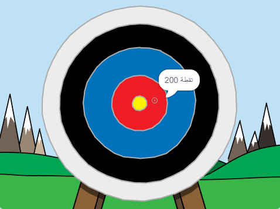

\--- no-print \---

هذا هو إصدار ** Scratch 3 ** من المشروع. هناك أيضًا [ إصدار Scratch 2 للمشروع ](https://projects.raspberrypi.org/en/projects/archery-scratch2).

\--- /no-print \---

## المقدمة

سوف تتعلم كيفية إنشاء لعبة الرماية ، حيث عليك أن تطلق السهام على مقربة من مركز الهدف.

### ما الذي ستصنعه

\--- no-print \---

انقر على العلم الأخضر للبدء. استخدم مفتاح المسافة لاطلاق سهم

  <iframe allowtransparency="true" width="485" height="402" src="https://scratch.mit.edu/projects/embed/114760038/?autostart=false" frameborder="0" scrolling="no"></iframe>
  

\--- /no-print \---

\--- print-only \---

\--- /print-only \---

## \--- collapse \---

## title: ما الذي ستحتاجه

### الأجهزة

+ جهاز كمبيوتر يدعم تشغيل برنامج Scratch

### البرامج

+ برنامج Scratch 3 (سواء أكان [عبر الإنترنت](http://rpf.io/scratchon){:target="_blank"} أو [دون اتصال بالإنترنت](http://rpf.io/scratchoff){:target="_blank"})

### للتحميل

برنامج البداية ستجده [هنا ](http://rpf.io/p/en/archery-go){:target="_blank"}.

\--- /collapse \---

## \--- collapse \---

## title: ما الذي ستتعلمه

+ استخدم الرسوم المتحركة 
+ استخدم البث (ارسال رسالة)
+ استخدم أرقام عشوائية

\--- /collapse \---

## \--- collapse \---

## title: معلومات إضافية للمعلمين

\--- no-print \---

إذا كنت بحاجة إلى طباعة هذا المشروع، فالرجاء استخدام [نسخة متوافقة مع الطابعة](https://projects.raspberrypi.org/en/projects/archery/print){:target="_blank"}.

\--- /no-print \---

يمكنك الحصول على [المشروع كاملاً من هنا](http://rpf.io/p/en/archery-get){:target="_blank"}.

\--- /collapse \---