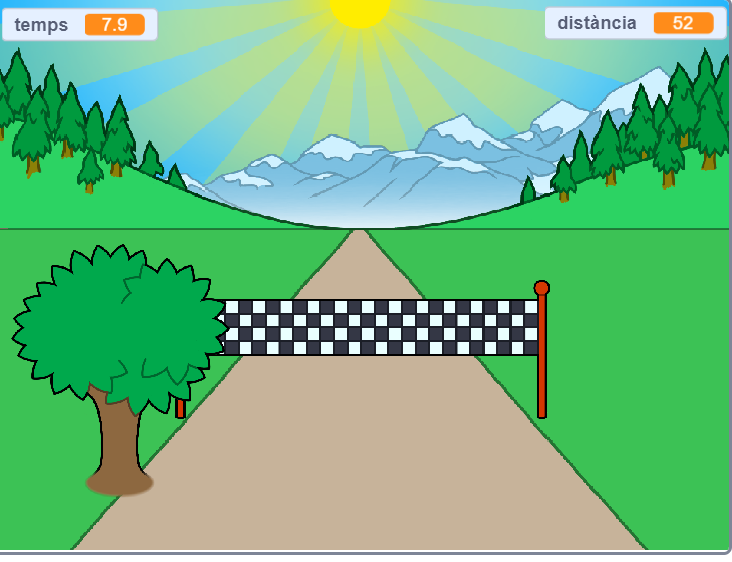

## I ara què ve?

Feu un cop d'ull al projecte [Esprint](https://projects.raspberrypi.org/en/projects/sprint) de Scratch.

Aprendreu a crear el vostre propi joc d’esprint, en el qual heu d’utilitzar les tecles de fletxa esquerra i dreta per arribar a la meta el més ràpidament possible.

--- no-print ---

  <iframe allowtransparency="true" width="485" height="402" src="https://scratch.mit.edu/projects/embed/298930696/?autostart=false" frameborder="0" scrolling="no"></iframe>
  

--- /no-print ---

--- print-only ---

--- /print-only ---