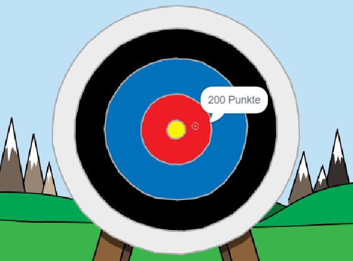

\--- no-print \---

Dies ist die **Scratch 3** Version des Projekts. Es gibt auch eine [Scratch 2 Version des Projekts](https://projects.raspberrypi.org/en/projects/archery-scratch2).

\--- /no-print \---

## Einleitung

Du wirst lernen, wie du ein Bogenschießspiel erstellst, bei dem du Pfeile so nah wie möglich an das Bullseye schießen musst.

### Was du machen wirst

\--- no-print \---

Klicke zum Starten auf die grüne Flagge. Verwende die Leertaste, um einen Pfeil abzuschießen

  <iframe allowtransparency="true" width="485" height="402" src="https://scratch.mit.edu/projects/embed/114760038/?autostart=false" frameborder="0" scrolling="no"></iframe>
  

\--- /no-print \---

\--- print-only \---

\--- /print-only \---

## \--- collapse \---

## title: Was du brauchen wirst

### Hardware

+ Ein Computer, auf dem Scratch ausgeführt werden kann

### Software

+ Scratch 3 (entweder [online](http://rpf.io/scratchon){:target="_blank"} oder [offline](http://rpf.io/scratchoff){:target="_blank"})

### Downloads

Das Start-Projekt findest du [hier](http://rpf.io/p/en/archery-go){:target="_blank"}.

\--- /collapse \---

## \--- collapse \---

## title: Was du lernen wirst

+ Animationen verwenden 
+ Nachrichten senden und empfangen
+ Zufallszahlen verwenden

\--- /collapse \---

## \--- collapse \---

## title: Zusätzliche Informationen für Pädagogen

\--- no-print \---

Wenn du dieses Projekt ausdrucken möchtest, verwende die [druckerfreundliche Version](https://projects.raspberrypi.org/en/projects/archery/print){:target="_blank"}.

\--- /no-print \---

Du findest das [abgeschlossene Projekt hier](http://rpf.io/p/en/archery-get){:target="_blank"}.

\--- /collapse \---