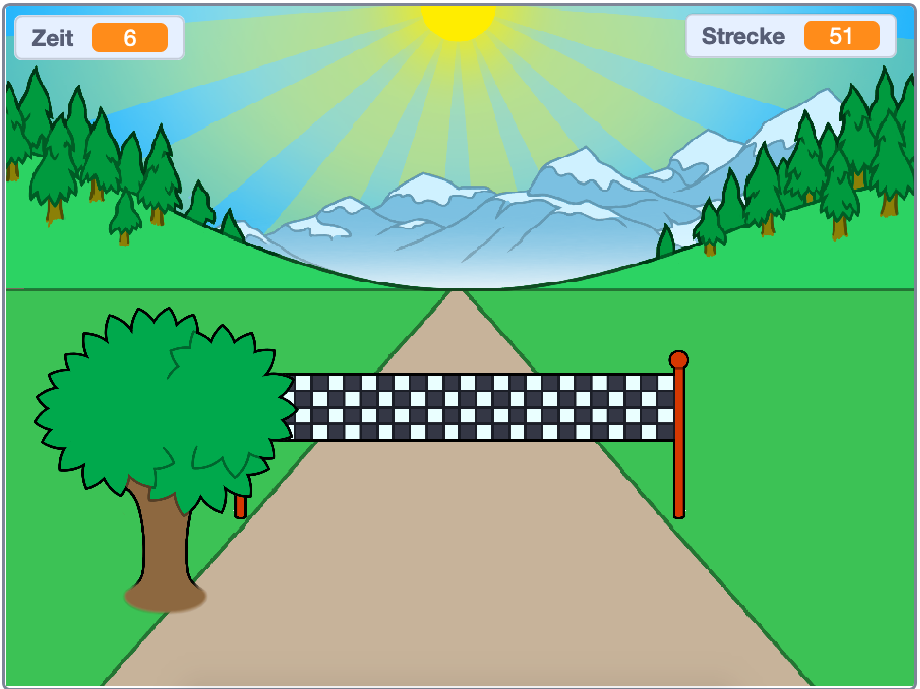

## Wie geht es weiter?

Schaue dir das [Sprint](https://projects.raspberrypi.org/de-DE/projects/sprint) Scratch-Projekt an.

Du wirst lernen, wie du dein eigenes Sprint Spiel erstellst, indem du die linke und rechte Pfeiltasten drückst, um so schnell wie möglich an die Ziellinie zu gelangen.

--- no-print ---

  <iframe allowtransparency="true" width="485" height="402" src="https://scratch.mit.edu/projects/embed/298930696/?autostart=false" frameborder="0" scrolling="no"></iframe>
  

--- /no-print ---

--- print-only ---

--- /print-only ---

***
Dieses Projekt wurde von freiwilligen Helfern übersetzt:

Dennis Weber

Tim

Dank freiwilliger Helfer können wir Menschen auf der ganzen Welt die Möglichkeit geben, in ihrer eigenen Sprache zu lernen. Du kannst uns helfen, mehr Menschen zu erreichen, indem Du dich freiwillig zum Übersetzen meldest - weitere Informationen unter [rpf.io/translate](https://rpf.io/translate).