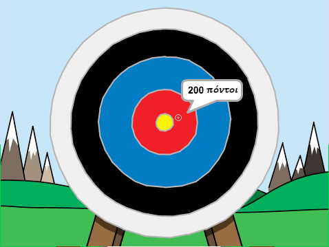

\--- no-print \---

Αυτή είναι η έκδοση **Scratch 3** του έργου. Υπάρχει επίσης η [έκδοση Scratch 2 του έργου](https://projects.raspberrypi.org/en/projects/archery-scratch2).

\--- /no-print \---

## Εισαγωγή

You are going to learn how to create an archery game, in which you have to shoot arrows as close to the bullseye as you can.

### Τι θα φτιάξεις

\--- no-print \---

Κάνε κλικ στην πράσινη σημαία για να ξεκινήσεις. Use the space bar to shoot an arrow

  <iframe allowtransparency="true" width="485" height="402" src="https://scratch.mit.edu/projects/embed/114760038/?autostart=false" frameborder="0" scrolling="no"></iframe>
  

\--- /no-print \---

\--- print-only \---

\--- /print-only \---

## \--- collapse \---

## title: What you will need

### Υλικό

+ Ένας υπολογιστής ικανός να τρέχει το Scratch

### Λογισμικό

+ Scratch 3 (είτε [online](http://rpf.io/scratchon){:target="_blank"} είτε [offline](http://rpf.io/scratchoff){:target="_blank"})

### Λήψεις

The starter project can be found [here](http://rpf.io/p/en/archery-go){:target="_blank"}.

\--- /collapse \---

## \--- collapse \---

## title: What you will learn

+ Use animations 
+ Use broadcasts
+ Use random numbers

\--- /collapse \---

## \--- collapse \---

## title: Additional information for educators

\--- no-print \---

If you need to print this project, please use the [printer-friendly version](https://projects.raspberrypi.org/en/projects/archery/print){:target="_blank"}.

\--- /no-print \---

You can find the [completed project here](http://rpf.io/p/en/archery-get){:target="_blank"}.

\--- /collapse \---