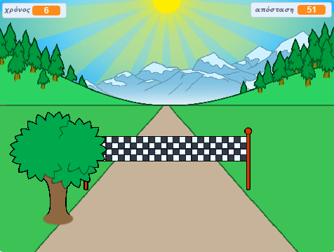

## Τι υπάρχει στη συνέχεια;

Ρίξε μια ματιά στο έργο [Sprint](https://projects.raspberrypi.org/en/projects/sprint) Scratch.

Θα μάθεις πώς να δημιουργείς το δικό σου παιχνίδι Sprint, στο οποίο θα πρέπει να χρησιμοποιήσεις το αριστερό και δεξί βέλος για να φτάσεις στη γραμμή τερματισμού όσο πιο γρήγορα μπορείς.

--- no-print ---

  <iframe allowtransparency="true" width="485" height="402" src="https://scratch.mit.edu/projects/embed/298930696/?autostart=false" frameborder="0" scrolling="no"></iframe>
  

--- /no-print ---

--- print-only ---

--- /print-only ---

***

Το έργο αυτό μεταφράστηκε από τους εθελοντές:

Efstathios Iosifidis
Κυριακή Ιντζεΐδου

Χάρη στους εθελοντές, μπορούμε να δώσουμε σε ανθρώπους σε όλο τον κόσμο την ευκαιρία να μάθουν στη γλώσσα τους. Μπορείτε να μας βοηθήσετε να προσεγγίσουμε περισσότερους ανθρώπους μεταφράζοντας εθελοντικά - περισσότερες πληροφορίες στο [rpf.io/translate](https://rpf.io/translate).