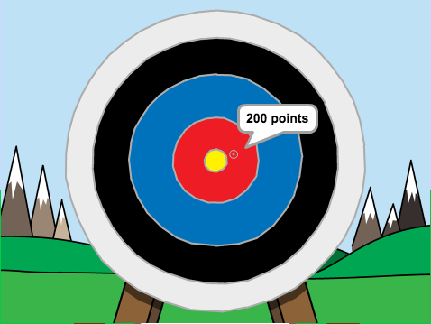

## Introduction

You are going to learn how to create an archery game, in which you have to shoot arrows as close to the bullseye as you can.

  <iframe allowtransparency="true" width="485" height="402" src="https://scratch.mit.edu/projects/embed/114760038/?autostart=false" frameborder="0"></iframe>
  

### Additional information for club leaders

If you need to print this project, please use the [Printer friendly version](https://projects.raspberrypi.org/en/projects/archery).

--- collapse ---
---
title: Club leader notes
---

## Introduction:
In this project, children will learn how to create an archery game, in which they have to shoot arrows as close to the bullseye as possible.

## Resources
For this project, Scratch 2 should be used. Scratch 2 can either be used online at [jumpto.cc/scratch-on](http://jumpto.cc/scratch-on) or can be downloaded from [jumpto.cc/scratch-off](http://jumpto.cc/scratch-off) and used offline.

The 'Project Materials' link for this project contains the following resources:

##### Club leader Resources

You can find a completed version of this project <a href="http://scratch.mit.edu/projects/114760038/#editor">online</a>, or it can be downloaded by clicking the 'Project Materials' link for this project, which contains:

+ Archery.sb2

##### Project Resources

For this project, club members can make use of a Scratch project containing the required resources. This project is available at [jumpto.cc/archery-resources](http://jumpto.cc/archery-resources), or it can be downloaded by clicking the 'Project Materials' link for this project, which contains:

+ ArcheryResources.sb2

Make sure that each child has access to a copy of these resources.

## Learning Objectives
+ Selection.

This project covers elements from the following strands of the [Raspberry Pi Digital Making Curriculum](http://rpf.io/curriculum):

+ [Use basic programming constructs to create simple programs.](https://www.raspberrypi.org/curriculum/programming/creator)

## Challenges
+ "Different scores" - Adding more `if`{:class="blockcontrol"} blocks so that hitting different parts of the target gives a different score. 

--- /collapse ---

--- collapse ---
---
title: Project materials
---
## Project resources
* [Online Scratch 2 project containing external resources](http://jumpto.cc/archery-resources)
* [Downloadable Scratch 2 project containing external resources](resources/ArcheryResources.sb2)

## Club leader resources
* [Online completed Scratch 2 project](http://scratch.mit.edu/projects/114760038/#editor)
* [Downloadable completed Scratch 2 project](resources/Archery.sb2)

--- /collapse ---