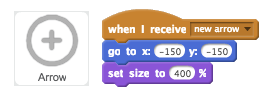
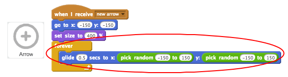

## Aiming arrows

Let's start by creating an arrow that moves around the screen.

+ Open the 'Archery' Scratch project. Your club leader will give you a copy of this project, or you can open it online at <a href="http://jumpto.cc/archery-resources" target="_blank">jumpto.cc/archery-resources</a>.

+ When your game starts, broadcast a message to shoot a new arrow.

	

+ Once this message has been received, set the arrow's position and size.

	

+ Click the green flag to test your game. You should see your arrow get bigger and move to the bottom-left of the stage.

	

+ Add code to your arrow so that it `glide`{:class="blockmotion"}s randomly around the stage `forever`{:class="blockcontrol"}.

	

+ Test your game again, and you should see your arrow move randomly around the stage.

	

