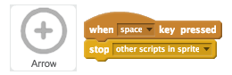
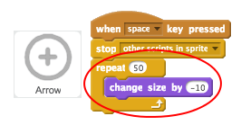
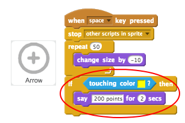
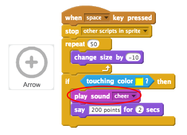
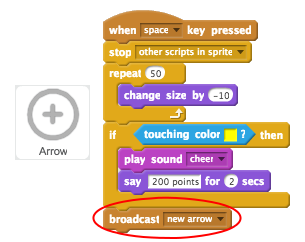

## Shooting arrows

Let's code your arrow to shoot when the space bar is pressed.

+ Stop the other script (the one moving the arrow) when the space bar is pressed.

	

+ Test your project again. This time, your arrow should stop moving __when the space bar is pressed__.

+ Animate your arrow, so that it looks like it's moving towards the target.

	

+ Test your game again. This time, when you press the space bar you should see your arrow get smaller, as if it's moving towards the target.

	

+ Once your arrow is at the target, you can tell the player how many points they have scored. For example, they could score 200 points for hitting the yellow.

	

+ You can also play a sound if they hit the yellow.

	

+ Finally, you need to broadcast the `new arrow`{:class="blockevents"} message again to get a new arrow.

	

