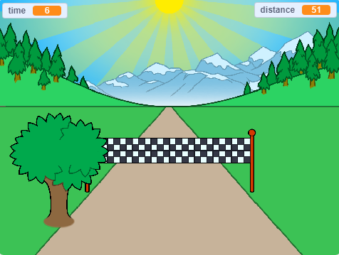

## What can you do now?

Try our [Sprint](https://projects.raspberrypi.org/en/projects/sprint) project where you will create your own sprint game, in which you have to use the left and right arrow keys to get to the finish line as quickly as you can.

--- print-only ---

--- /print-only ---

--- no-print ---

  <iframe allowtransparency="true" width="485" height="402" src="https://scratch.mit.edu/projects/embed/298930696/?autostart=false" frameborder="0" scrolling="no"></iframe>
  

--- /no-print ---

Or, why not try out another [Scratch](https://projects.raspberrypi.org/en/projects?software%5B%5D=scratch) project?

