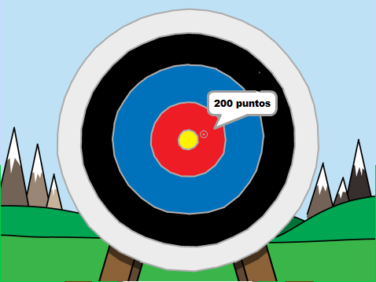

\--- no-print \---

Esta es la versión **Scratch 3** del proyecto. También hay una [versión del proyecto en Scratch 2](https://projects.raspberrypi.org/en/projects/archery-scratch2).

\--- /no-print \---

## Introducción

Aprenderás a crear un juego de tiro con arco, en el que debes disparar flechas lo más cerca posible del blanco de la diana.

### Lo que harás

\--- no-print \---

Haz clic en la bandera verde para empezar. Usa la barra espaciadora para disparar una flecha

  <iframe allowtransparency="true" width="485" height="402" src="https://scratch.mit.edu/projects/embed/114760038/?autostart=false" frameborder="0" scrolling="no"></iframe>
  

\--- /no-print \---

\--- print-only \---

\--- /print-only \---

## \--- collapse \---

## title: Lo que necesitarás

### Equipo

+ Una computadora capaz de ejecutar Scratch

### Programas

+ Scratch 3 (either [online](https://rpf.io/scratchon){:target="_blank"} or [offline](https://rpf.io/scratchoff){:target="_blank"})

### Descargas

The starter project can be found [here](https://rpf.io/p/en/archery-go){:target="_blank"}.

\--- /collapse \---

## \--- collapse \---

## title: Lo que aprenderás

+ Usar animaciones 
+ Usar transmisiones
+ Usar números aleatorios

\--- /collapse \---

## \--- collapse \---

## title: Información adicional para educadores

\--- no-print \---

Si necesitas imprimir este proyecto, usa la [versión para imprimir](https://projects.raspberrypi.org/en/projects/archery/print){:target="_blank"}.

\--- /no-print \---

You can find the [completed project here](https://rpf.io/p/en/archery-get){:target="_blank"}.

\--- /collapse \---