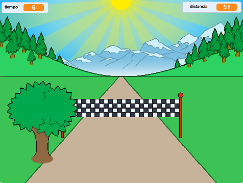

## ¿Qué sigue?

Mira el proyecto [Carrera](https://projects.raspberrypi.org/en/projects/sprint) de Scratch.

Aprenderás a crear tu propio juego de carreras, en el que debes usar las teclas de dirección izquierda y derecha para llegar a la línea de meta lo más rápido posible.

--- no-print ---

  <iframe allowtransparency="true" width="485" height="402" src="https://scratch.mit.edu/projects/embed/298930696/?autostart=false" frameborder="0" scrolling="no"></iframe>
  

--- /no-print ---

--- print-only ---

--- /print-only ---