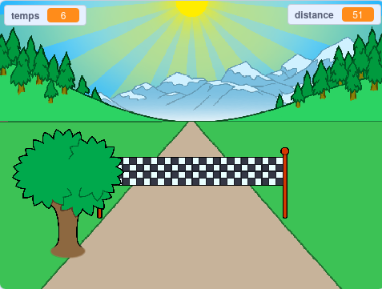

## Et ensuite ?

Jette un œil au projet Scratch [Sprint](https://projects.raspberrypi.org/en/projects/sprint).

Tu vas apprendre à créer ton propre jeu de sprint, dans lequel tu devras utiliser les touches fléchées gauche et droite pour arriver à la ligne d'arrivée le plus rapidement possible.

--- no-print ---

  <iframe allowtransparency="true" width="485" height="402" src="https://scratch.mit.edu/projects/embed/298930696/?autostart=false" frameborder="0" scrolling="no"></iframe>
  

--- /no-print ---

--- print-only ---

--- /print-only ---