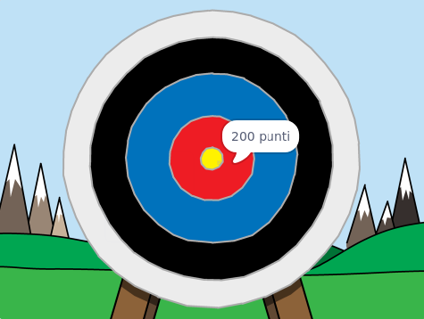

\--- no-print \---

Questa è la versione **Scratch 3** del progetto. C'è anche una versione [Scratch 2 del progetto](https://projects.raspberrypi.org/en/projects/archery-scratch2).

\--- /no-print \---

## Introduzione

Imparerai come creare un gioco di tiro con l'arco, in cui devi tirare le frecce il più vicino possibile al centro.

### Che cosa creerai

\--- no-print \---

Clicca sulla bandiera verde per cominciare. Usa la barra spaziatrice per scoccare una freccia

  <iframe allowtransparency="true" width="485" height="402" src="https://scratch.mit.edu/projects/embed/114760038/?autostart=false" frameborder="0" scrolling="no"></iframe>
  

\--- /no-print \---

\--- print-only \---

\--- /print-only \---

## \--- collapse \---

## title: Di cosa avrai bisogno

### Hardware

+ Un computer in grado di eseguire Scratch

### Software

+ Scratch 3 (either [online](https://rpf.io/scratchon){:target="_blank"} or [offline](https://rpf.io/scratchoff){:target="_blank"})

### Download

The starter project can be found [here](https://rpf.io/p/en/archery-go){:target="_blank"}.

\--- /collapse \---

## \--- collapse \---

## title: Cosa imparerai

+ Usare le animazioni 
+ Usare i messaggi
+ Usare numeri casuali

\--- /collapse \---

## \--- collapse \---

## title: Informazioni aggiuntive per gli educatori

\--- no-print \---

Se intendete stampare questo progetto, cliccate su [Versione stampabile](https://projects.raspberrypi.org/en/projects/archery/print){:target="_ blank"}.

\--- /no-print \---

You can find the [completed project here](https://rpf.io/p/en/archery-get){:target="_blank"}.

\--- /collapse \---