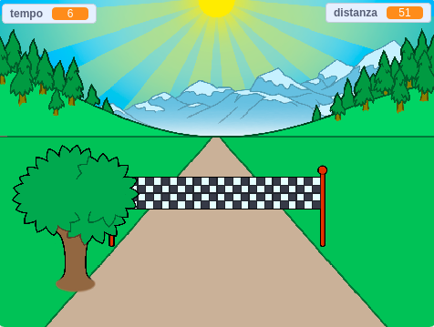

## E poi?

Dai un'occhiata al progetto Scratch [Sprint](https://projects.raspberrypi.org/en/projects/sprint).

Stai per imparare a creare il tuo gioco sprint, in cui devi usare i tasti freccia sinistra e destra per arrivare al traguardo il più velocemente possibile.

--- no-print ---

  <iframe allowtransparency="true" width="485" height="402" src="https://scratch.mit.edu/projects/embed/298930696/?autostart=false" frameborder="0" scrolling="no"></iframe>
  

--- /no-print ---

--- print-only ---

--- /print-only ---

Questo progetto è stato tradotto da volontari:

Alessio Spadaro
Fabrizio Sala

Grazie ai volontari, possiamo offrire alle persone di tutto il mondo la possibilità di imparare nella loro lingua. Puoi aiutarci a raggiungere più persone offrendoti come volontario per la traduzione - puoi trovare maggiori informazioni su [rpf.io/translate](https://rpf.io/translate).