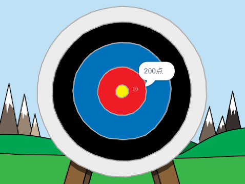

--- no-print ---

これはプロジェクトの**Scratch 3**バージョンです。 [Scratch 2バージョンのプロジェクト](https://projects.raspberrypi.org/en/projects/archery-scratch2)もあります。

--- /no-print ---

## はじめに

アーチェリーゲームの作り方を学びます。このゲームでは、できるだけまとの中心に矢をあてます。

### 作るもの

--- no-print ---

緑の旗 (はた) をクリックしてスタートします。 スペースバーを使って矢をはなちます。

  <iframe allowtransparency="true" width="485" height="402" src="https://scratch.mit.edu/projects/embed/382679142/?autostart=false" frameborder="0" scrolling="no"></iframe>
  

--- /no-print ---

--- print-only ---

--- /print-only ---

--- collapse ---
---
title: 必要 (ひつよう) なもの
---
### ハードウェア

+ Scratch を実行できるコンピュータ

### ソフトウェア

+ Scratch 3 ([オンライン](https://rpf.io/scratchon){:target="_blank"}または[オフライン](https://rpf.io/scratchoff){:target="_blank"})

### ダウンロード

基本 (きほん) のプロジェクトは [こちら](https://rpf.io/p/ja-JP/archery-go){:target="_blank"}にあります。

--- /collapse ---

--- collapse ---
---
title: 学ぶこと
---
+ アニメーションを使う 
+ メッセージを使う
+ 乱数 (らんすう) を使う

--- /collapse ---

--- collapse ---
---
title: 教育者向けの追加情報
---
--- no-print ---

このプロジェクトを印刷する必要がある場合は、 [印刷用バージョン](https://projects.raspberrypi.org/ja-JP/projects/archery/print){:target="_blank"}を使用してください。

--- /no-print ---

[完成したプロジェクトはこちらに](https://rpf.io/p/ja-JP/archery-get){:target="_blank"}あります 。

--- /collapse ---
