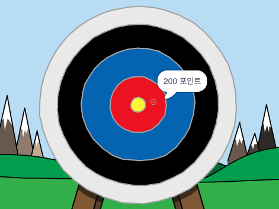

--- no-print ---

이 프로젝트의 **스크래치 3** 버전입니다. [프로젝트의 스크래치 2 버전](https://projects.raspberrypi.org/en/projects/archery-scratch2)도 있습니다.

--- /no-print ---

## 들어가며

이 프로젝트에서는 양궁 게임을 만드는 방법을 배웁니다. 과녁 중앙에 최대한 가깝게 화살을 쏴야 합니다.

### 여러분이 만들 작품

--- no-print ---

시작하려면 녹색 깃발을 클릭하십시오. 스페이스 바를 사용하여 화살을 쏠 수 있습니다.

  <iframe allowtransparency="true" width="485" height="402" src="https://scratch.mit.edu/projects/embed/382439028/?autostart=false" frameborder="0" scrolling="no"></iframe>
  

--- /no-print ---

--- print-only ---

--- /print-only ---

--- collapse ---
---
title: 준비물
---
### 하드웨어

+ 스크래치를 실행할 수 있는 컴퓨터

### 소프트웨어

+ 스크래치 3 ( [온라인](https://rpf.io/scratchon){:target="_blank"} 또는 [offline](https://rpf.io/scratchoff){:target="_blank"})

### 다운로드

스타터 프로젝트는 [여기](https://rpf.io/p/ko-KR/archery-go){:target="_blank"}를 클릭하면 열 수 있습니다.

--- /collapse ---

--- collapse ---
---
title: 이런 것들을 배우게 됩니다.
---
+ 애니메이션 사용 
+ 신호 보내기 사용
+ 난수 사용

--- /collapse ---

--- collapse ---
---
title: 교육자를 위한 추가 정보
---
--- no-print ---

이 프로젝트를 인쇄하려면, [프린트용 버전](https://projects.raspberrypi.org/ko-KR/projects/archery/print){:target="_blank"}을 사용하십시오.

--- /no-print ---

완성된 프로젝트는 [여기](https://rpf.io/p/ko-KR/archery-get){:target="_ blank"}에서 확인할 수 있습니다.

--- /collapse ---
