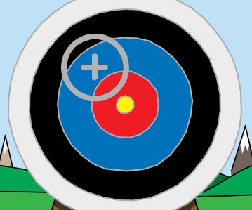

## 화살 조준

화면 주위를 이동하는 화살을 만드는 것으로 시작하겠습니다.

\--- task \---

스크래치 스타터 프로젝트를 엽니다.

**Online**: open the starter project at [rpf.io/archeryon](https://rpf.io/archeryon){:target="_blank"}.

스크래치 계정이 있는 경우 **Remix를 클릭** 하여 사본을 만들 수 있습니다.

**Offline**: open the [starter project](https://rpf.io/p/en/archery-go){:target="_blank"} in the offline editor.

If you need to download and install the Scratch offline editor, you can find it at [rpf.io/scratchoff](https://rpf.io/scratchoff){:target="_blank"}.

스타터 프로젝트에서 배경과 십자가 모양의 스프라이트를 확인할 수 있습니다.


\--- /task \---

\--- task \---

게임이 시작되면 새 화살을 쏘라는 신호를 보내세요.


```blocks3
when green flag clicked
broadcast (new arrow v)
```

\--- /task \---

\--- task \---

이 신호를 받게되면 십자가의 위치와 크기를 설정하십시오.


```blocks3
when I receive [new arrow v]
go to x: (-150) y: (-150)
set size to (400) %
```

\--- /task \---

\--- task \---

녹색 깃발을 눌러 시작합니다. 십자가가 커지고 스테이지 왼쪽 하단으로 이동하는 것이 보여야 합니다.


\--- /task \---

\--- task \---

`이동하기`{:class="block3motion"} 블록을 화살 스프라이트에 추가하여 스테이지의 무작위 위치로의 이동이 `무한 반복`{:class="block3control"}되게 하세요.


```blocks3
when I receive [new arrow v]
go to x: (-150) y: (-150)
set size to (400) %
+forever
glide (0.5) secs to x: (pick random (-150) to (150)) y: (pick random (-150) to (150))
end
```

\--- /task \---

\--- task \---

게임을 다시 테스트해봅니다. 그리고 스테이지에서 십자가가 무작위로 움직이는 것을 볼 수 있어야 합니다.



\--- /task \---