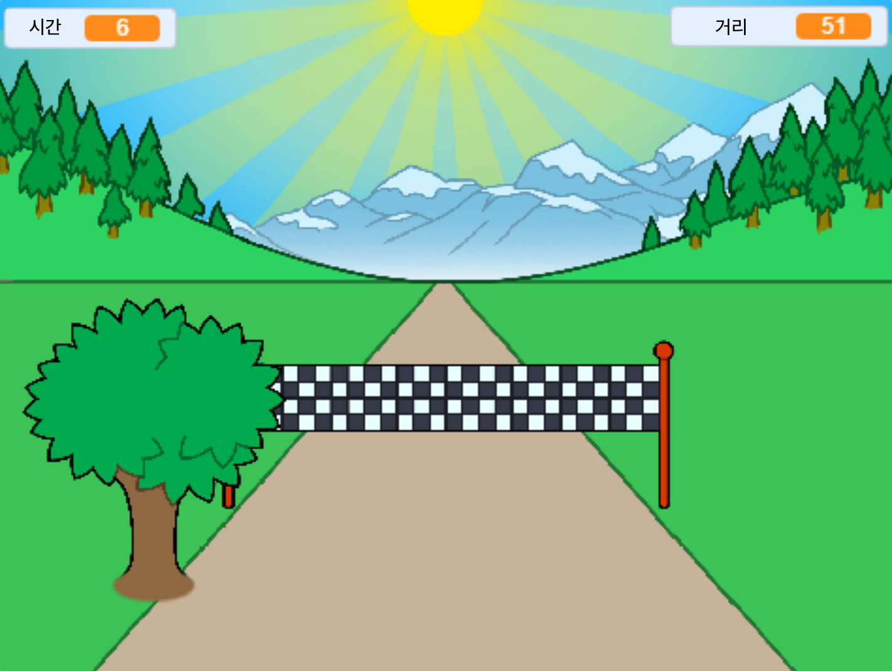

## 더 나아가기

[전력질주](https://projects.raspberrypi.org/en/projects/sprint) 스크래치 프로젝트를 살펴봅시다.

결승선에 빨리 도달하려면 왼쪽 및 오른쪽 화살표 키를 사용해야 하는 여러분만의 전력질주 게임을 만드는 방법을 배우게 될 것입니다.

--- no-print ---

  <iframe allowtransparency="true" width="485" height="402" src="https://scratch.mit.edu/projects/embed/298930696/?autostart=false" frameborder="0" scrolling="no"></iframe>
  

--- /no-print ---

--- print-only ---

--- /print-only ---