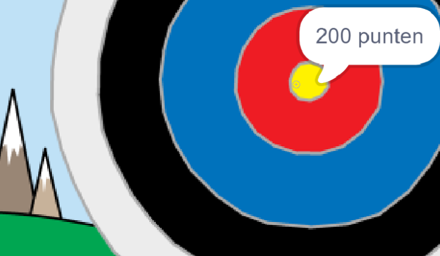

--- no-print ---

Dit is de **Scratch 3** versie van het project. Er is ook een [Scratch 2 versie van dit project](https://projects.raspberrypi.org/en/projects/archery-scratch2).

--- /no-print ---

## Inleiding

Je gaat leren hoe je een boogschietspel maakt, waarbij je pijlen zo dicht mogelijk bij de roos moet schieten.

### Wat ga je maken

--- no-print ---

Klik op de groene vlag om te starten. Gebruik de spatiebalk om een pijl af te schieten

  <iframe allowtransparency="true" width="485" height="402" src="https://scratch.mit.edu/projects/embed/382068478/?autostart=false" frameborder="0" scrolling="no"></iframe>
  

--- /no-print ---

--- print-only ---

--- /print-only ---

--- collapse ---
---
title: Wat heb je nodig
---
### Hardware

+ Een computer die Scratch kan uitvoeren

### Software

+ Scratch 3 ([online](https://rpf.io/scratchon){:target="_blank"} of [offline](https://rpf.io/scratchoff){:target="_blank"})

### Downloads

Het startproject kan [hier](https://rpf.io/p/nl-NL/archery-go){:target="_blank"} gevonden worden.

--- /collapse ---

--- collapse ---
---
title: Wat ga je leren
---
+ Gebruik animaties 
+ Gebruik signalen
+ Gebruik willekeurige getallen

--- /collapse ---

--- collapse ---
---
title: Aanvullende informatie voor docenten
---
--- no-print ---

Als je dit project wilt afdrukken, gebruik dan de [printvriendelijke versie](https://projects.raspberrypi.org/nl-NL/projects/archery/print){:target="_ blank"}.

--- /no-print ---

Je kunt het [voltooide project hier](https://rpf.io/p/nl-NL/archery-get){:target="_blank"} vinden.

--- /collapse ---
