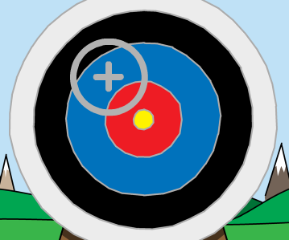

## Richten van pijlen

Laten we beginnen met het maken van een pijl die over het scherm beweegt.

--- task ---

Open het Scratch startproject.

**Online**: open het startproject via [scratch.mit.edu/projects/382067811](https://scratch.mit.edu/projects/382067811){:target="_ blank"}.

Als je een Scratch account hebt, kun je een kopie maken door op **Remix** te klikken.

**Offline**: open het [startproject](https://rpf.io/p/nl-NL/archery-go){:target="_ blank"} in de offline editor.

Als je de Scratch offline editor wilt downloaden en installeren dan kan je die vinden op [rpf.io/scratchoff](https://rpf.io/scratchoff){:target="_blank"}.

In het startproject zou je een doelwit-achtergrond en een dradenkruis moeten zien.


--- /task ---

--- task ---

Wanneer je spel begint, zend dan een signaal uit om een nieuwe pijl te schieten.


```blocks3
when green flag clicked
broadcast (nieuwe pijl v)
```

--- /task ---

--- task ---

Zodra dit signaal is ontvangen, stel je de positie en grootte van de pijl in.


```blocks3
when I receive [nieuwe pijl v]
go to x: (-150) y: (-150)
set size to (400) %
```

--- /task ---

--- task ---

Klik op de groene vlag om je spel te testen. Je zou je pijl groter moeten zien worden en naar de linkerbenedenhoek van het podium zien gaan.


--- /task ---

--- task ---

Voeg code toe aan je pijl zodat deze `continu`{:class="block3control"} willekeurig rond `beweegt`{:class="block3motion"}.


```blocks3
when I receive [nieuwe pijl v]
go to x: (-150) y: (-150)
set size to (400) %
+forever
glide (0.5) secs to x: (pick random (-150) to (150)) y: (pick random (-150) to (150))
end
```

--- /task ---

--- task ---

Test je spel opnieuw en je zou je pijl willekeurig over het speelveld moeten zien bewegen.



--- /task ---
