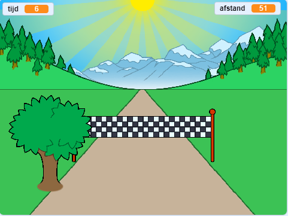

## Wat kun je verder nog doen?

Bekijk het [Sprint](https://projects.raspberrypi.org/en/projects/sprint) Scratch project.

Je leert hoe je je eigen sprintspel maakt, waarbij je de linker- en rechterpijltoetsen moet gebruiken om zo snel mogelijk naar de finish te komen.

--- no-print ---

  <iframe allowtransparency="true" width="485" height="402" src="https://scratch.mit.edu/projects/embed/298930696/?autostart=false" frameborder="0" scrolling="no"></iframe>
  

--- /no-print ---

--- print-only ---

--- /print-only ---

***

Dit project werd vertaald door vrijwilligers:

Sanneke van der Meer
Robert-Jan Kempenaar

Dankzij vrijwilligers kunnen we mensen over de hele wereld de kans geven om in hun eigen taal te leren. Jij kunt ons helpen meer mensen te bereiken door vrijwillig te starten met vertalen - meer informatie op [rpf.io/translate](https://rpf.io/translate).