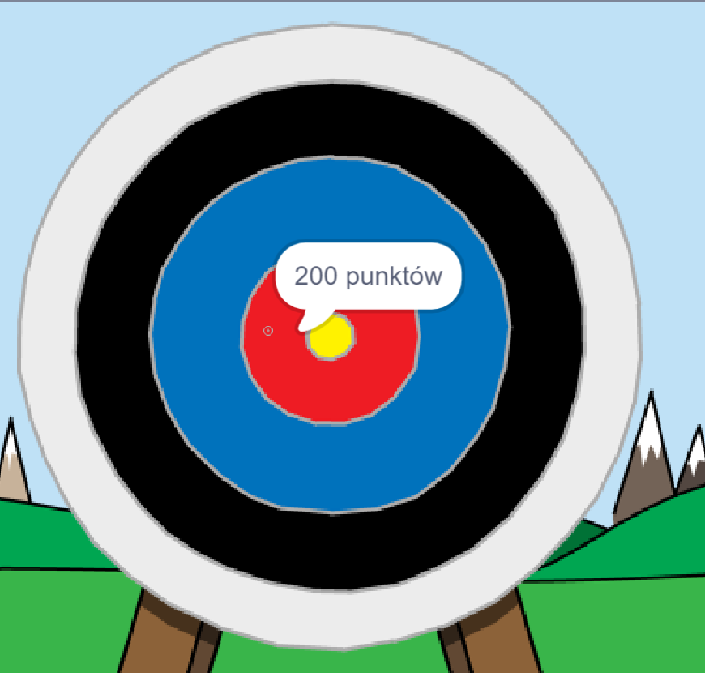

\--- no-print \---

To jest wersja projektu korzystająca z **Scratch 3**. Istnieje również [wersja tego projektu dla Scratch 2](https://projects.raspberrypi.org/en/projects/archery-scratch2).

\--- /no-print \---

## Wprowadzenie

Nauczysz się tworzyć grę łuczniczą, w której musisz strzelać z łuku jak najbliżej środka.

### Co zrobisz

\--- no-print \---

Kliknij na zieloną flagę, aby rozpocząć. Użyj spacji, aby wystrzelić strzałę

  <iframe allowtransparency="true" width="485" height="402" src="https://scratch.mit.edu/projects/embed/114760038/?autostart=false" frameborder="0" scrolling="no"></iframe>
  

\--- /no-print \---

\--- print-only \---

\--- /print-only \---

## \--- collapse \---

## title: Czego będziesz potrzebować

### Sprzęt

+ Komputer, na którym można uruchomić Scratcha

### Oprogramowanie

+ Scratch 3 ([online](https://rpf.io/scratchon){:target="_blank"} lub [offline](https://rpf.io/scratchoff){:target="_blank"})

### Do pobrania

Projekt startowy można znaleźć [tutaj](https://rpf.io/p/pl-PL/archery-go){:target="_blank"}.

\--- /collapse \---

## \--- collapse \---

## title: Czego się nauczysz

+ Używania animacji 
+ Używania komunikatów
+ Używania liczb losowych

\--- /collapse \---

## \--- collapse \---

## title: Dodatkowe informacje dla nauczycieli

\--- no-print \---

Jeśli chcesz wydrukować ten projekt, użyj [wersji do druku](https://projects.raspberrypi.org/en/projects/archery/print){:target="_blank"}.

\--- /no-print \---

Możesz znaleźć [ukończoną wersję projektu tutaj](https://rpf.io/p/en/archery-get){:target="_blank"}.

\--- /collapse \---