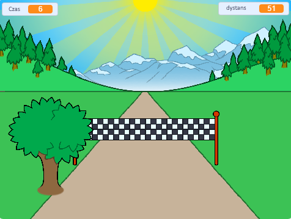

## Co dalej?

Wypróbuj projekt [Sprint](https://projects.raspberrypi.org/en/projects/sprint) w Scratchu.

W nim dowiesz się, jak stworzyć własną grę sprinterską, w której używasz klawiszy strzałek, żeby jak najszybciej dotrzeć do mety.

--- no-print ---

  <iframe allowtransparency="true" width="485" height="402" src="https://scratch.mit.edu/projects/embed/298930696/?autostart=false" frameborder="0" scrolling="no"></iframe>
  

--- /no-print ---

--- print-only ---

--- /print-only ---