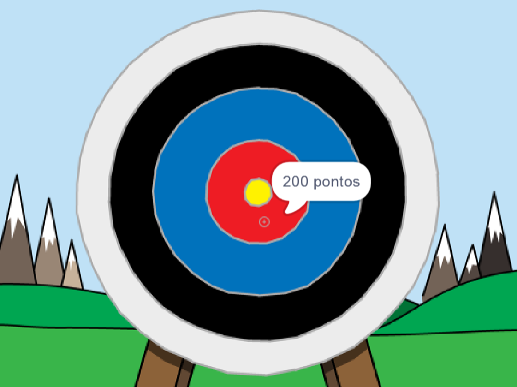

--- no-print ---

Esta é a versão **Scratch 3** do projeto. Existe também uma versão [Scratch 2 do projeto](https://projects.raspberrypi.org/en/projects/archery-scratch2).

--- /no-print ---

## Introdução

Vais aprender a criar um jogo de tiro com arco, no qual tens que atirar flechas para o mais próximo possível do alvo.

### O que vais fazer

--- no-print ---

Clica na bandeira verde para começar. Usa a barra de espaços para atirar uma flecha

  <iframe allowtransparency="true" width="485" height="402" src="https://scratch.mit.edu/projects/embed/382475689/?autostart=false" frameborder="0" scrolling="no"></iframe>
  

--- /no-print ---

--- print-only ---

--- /print-only ---

--- collapse ---
---
title: O que vais precisar
---
### Hardware

+ Um computador com capacidade para executar o Scratch

### Software

+ Scratch 3 (ou [online](https://rpf.io/scratchon){:target="_blank"} ou [offline](https://rpf.io/scratchoff){:target="_blank"})

### Downloads

O projeto inicial está [aqui](https://rpf.io/p/pt-PT/archery-go){:target="_blank"}.

--- /collapse ---

--- collapse ---
---
title: O que é que vais aprender
---
+ Usar animações 
+ Usar o envio de mensagens
+ Usar números aleatórios

--- /collapse ---

--- collapse ---
---
title: Informações adicionais para educadores
---
--- no-print ---

Se necessitas imprimir este projeto, por favor, utiliza a [versão para impressão](https://projects.raspberrypi.org/pt-PT/projects/archery/print){:target="_blank"}.

--- /no-print ---

Podes encontrar o [projeto concluído aqui](https://rpf.io/p/pt-PT/archery-get){:target="_blank"}.

--- /collapse ---
