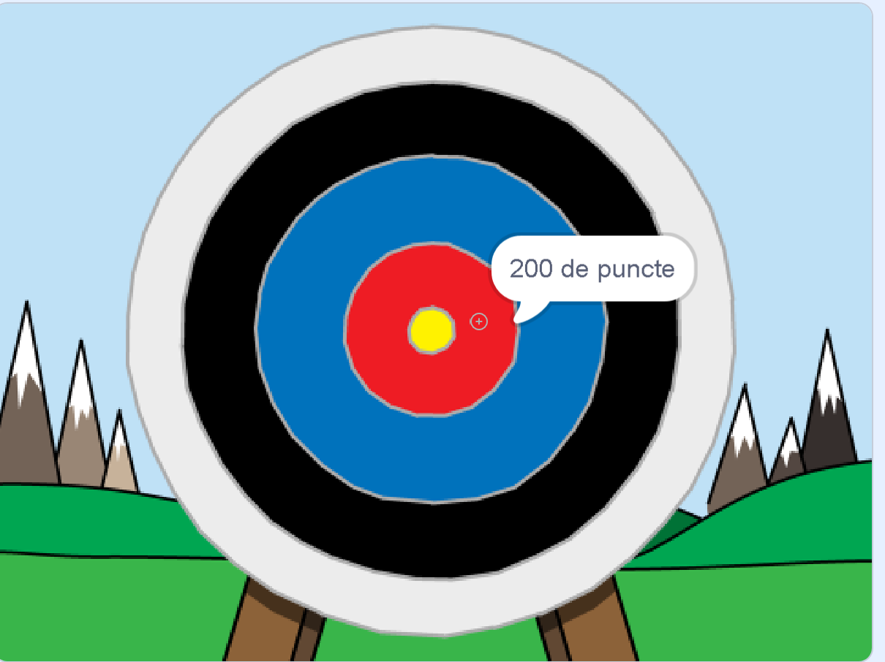

--- no-print ---

Aceasta este versiunea **Scratch 3** a proiectului. Există, de asemenea, o versiune de [Scratch 2 a proiectului](https://projects.raspberrypi.org/en/projects/archery-scratch2).

--- /no-print ---

## Introducere

Vei învăța cum să creezi un joc în care poți să tragi cu arcul, cu scopul de a trage săgeți cât mai aproape de „bullseye” (centrul țintei).

### Ce vei face

--- no-print ---

Dă click pe steagul verde pentru a începe. Folosește bara de spațiu pentru a trage o săgeată

  <iframe allowtransparency="true" width="485" height="402" src="https://scratch.mit.edu/projects/embed/382477406/?autostart=false" frameborder="0" scrolling="no"></iframe>
  

--- /no-print ---

--- print-only ---

--- /print-only ---

--- collapse ---
---
title: De ce vei avea nevoie
---
### Hardware

+ Un computer capabil de a rula Scratch

### Software

+ Scratch 3 (fie [online](https://rpf.io/scratchon){:target="_blank"} sau [offline](https://rpf.io/scratchoff){:target="_blank"})

### Fișiere descărcabile

Proiectul inițial poate fi găsit [aici](https://rpf.io/p/ro-RO/archery-go){:target="_blank"}.

--- /collapse ---

--- collapse ---
---
title: Ce vei învăța
---
+ Să folosești animații 
+ Să folosești transmisiunile
+ Să folosești numere aleatorii

--- /collapse ---

--- collapse ---
---
title: Informații suplimentare pentru educatori
---
--- no-print ---

Dacă ai nevoie să tipărești acest proiect, folosește [versiunea printabilă](https://projects.raspberrypi.org/ro-RO/projects/archery/print){:target="_blank"}.

--- /no-print ---

Poți găsi [proiectul finalizat aici](https://rpf.io/p/ro-RO/archery-get){:target="_blank"}.

--- /collapse ---
