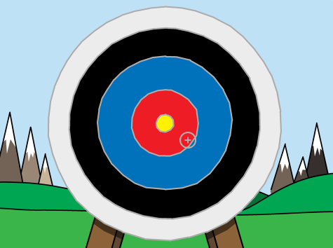

## Ținta săgeților

Să începem prin crearea unei săgeți care se mișcă pe ecran.

--- task ---

Deschide proiectul Scratch de început.

**Online**: deschide proiectul de bază de la [scratch.mit.edu/projects/382476929](https://scratch.mit.edu/projects/382476929){:target="_blank"}.

Dacă ai un cont Scratch, poți să creezi o copie dând click pe **Remix**.

**Offline**: deschide [proiectul de bază](http://rpf.io/p/ro-RO/archery-go){:target="_blank"} în editorul offline.

Dacă trebuie să descarci și să instalezi editorul Scratch offline, îl poți găsi la [rpf.io/scratchoff](http://rpf.io/scratchoff){:target="_blank"}.

În proiectul de început, ar trebui să vezi un fundal de țintă și un costum cu o cruce roșie.



--- /task ---

--- task ---

Când jocul tău începe, difuzează un mesaj pentru a trage o nouă săgeată.


```blocks3
when green flag clicked
broadcast (săgeată nouă v)
```

--- /task ---

--- task ---

Odată ce acest mesaj a fost primit, setează poziția și dimensiunea săgeții.


```blocks3
when I receive [săgeată nouă v]
go to x: (-150) y: (-150)
set size to (400) %
```

--- /task ---

--- task ---

Dă click pe steagul verde pentru a-ți testa jocul. Ar trebui să-ți vezi săgeata că se mărește și că se mișcă în partea de stângă jos a scenei.


--- /task ---

--- task ---

Adaugă o secvență de cod la săgeata ta astfel încât aceasta să `alunece`{:class="block3motion"} la întâmplare în jurul scenei `la infinit`{:class="block3control"}.


```blocks3
when I receive [săgeată nouă v]
go to x: (-150) y: (-150)
set size to (400) %
+forever
glide (0.5) secs to x: (pick random (-150) to (150)) y: (pick random (-150) to (150))
end
```

--- /task ---

--- task ---

Testează-ți jocul din nou și ar trebui să vezi cum săgeata ta se mișcă aleatoriu în jurul scenei.


--- /task ---