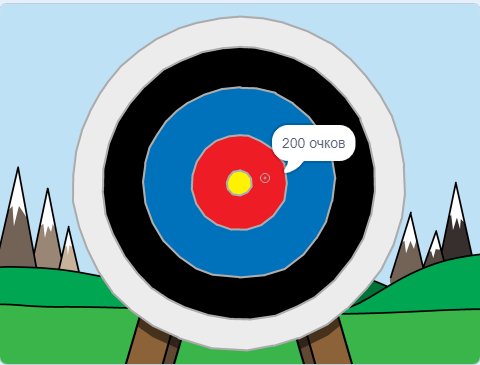

\--- no-print \---

Это версия проекта для **Scratch 3**. Есть также [версия проекта для Scratch 2](https://projects.raspberrypi.org/en/projects/archery-scratch2).

\--- /no-print \---

## Введение

Ты узнаешь, как создать игру стрельба из лука, в которой ты должен стрелять стрелами как можно ближе в яблочко.

### Что тебе нужно будет сделать

\--- no-print \---

Нажми на зеленый флаг, чтобы начать. Используйте пробел, чтобы выстрелить стрелой

  <iframe allowtransparency="true" width="485" height="402" src="https://scratch.mit.edu/projects/embed/114760038/?autostart=false" frameborder="0" scrolling="no"></iframe>
  

\--- /no-print \---

\--- print-only \---

\--- /print-only \---

## \--- collapse \---

## title: Что тебе понадобится

### Оборудование

+ Компьютер, способный запускать Scratch

### Программное обеспечение

+ Scratch 3 (either [online](https://rpf.io/scratchon){:target="_blank"} or [offline](https://rpf.io/scratchoff){:target="_blank"})

### Загрузки

The starter project can be found [here](https://rpf.io/p/en/archery-go){:target="_blank"}.

\--- /collapse \---

## \--- collapse \---

## title: Чему ты научишься

+ Использовать анимацию 
+ Использовать передачу сообщений
+ Использовать случайные числа

\--- /collapse \---

## \--- collapse \---

## title: Дополнительная информация для преподавателей

\--- no-print \---

Если вы хотите распечатать этот проект, то воспользуйтесь [версией для печати](https://projects.raspberrypi.org/en/projects/archery/print){:target="_blank"}.

\--- /no-print \---

You can find the [completed project here](https://rpf.io/p/en/archery-get){:target="_blank"}.

\--- /collapse \---