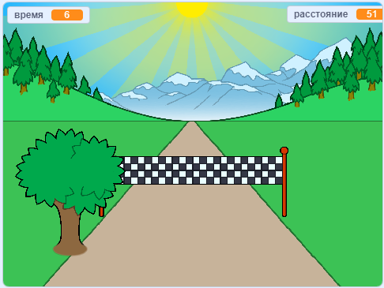

## Что дальше?

Взгляни на проект Scratch [Спринт](https://projects.raspberrypi.org/en/projects/sprint).

Ты узнаешь, как создать свою собственную спринт-игру, в которой тебе нужно использовать клавиши со стрелками влево и вправо, чтобы добраться до финиша как можно быстрее.

--- no-print ---

  <iframe allowtransparency="true" width="485" height="402" src="https://scratch.mit.edu/projects/embed/298930696/?autostart=false" frameborder="0" scrolling="no"></iframe>
  

--- /no-print ---

--- print-only ---

--- /print-only ---