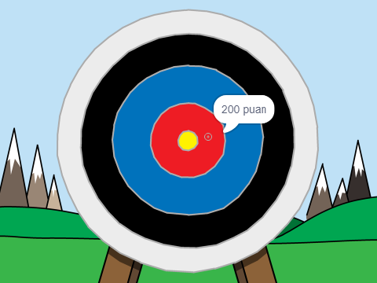

\--- no-print \---

Bu, projenin **Scratch 3** versiyonudur. Ayrıca projenin bir de [Scratch 2 versiyonu](https://projects.raspberrypi.org/en/projects/archery-scratch2) bulunmaktadır.

\--- /no-print \---

## Giriş

Burada, okları hedef tahtasına mümkün olduğunca yakın atman gereken bir okçuluk oyununu yapmayı öğreneceksiniz.

### Ne yapacaksınız

\--- no-print \---

Başlamak için yeşil bayrağa tıklayın. Bir ok atmak için boşluk tuşunu kullanın

  <iframe allowtransparency="true" width="485" height="402" src="https://scratch.mit.edu/projects/embed/114760038/?autostart=false" frameborder="0" scrolling="no"></iframe>
  

\--- /no-print \---

\--- print-only \---

\--- /print-only \---

## \--- collapse \---

## title: Nelere ihtiyacınız var

### Donanım

+ Scratch çalıştırabilen bir bilgisayar

### Yazılım

+ ([Çevrimiçi](http://rpf.io/scratchon){:target="_blank"} veya [çevrimdışı](http://rpf.io/scratchoff){:target="_blank"}) Scratch 3

### İndirilenler

Başlangıç projesini [burada](http://rpf.io/p/en/archery-go){:target="_blank"} bulabilirsiniz.

\--- /collapse \---

## \--- collapse \---

## title: Neler öğreneceksiniz

+ Animasyonları kullanma 
+ Yayınları kullanma
+ Rastgele sayıları kullanma

\--- /collapse \---

## \--- /collapse \---

## title: Eğitimciler için ek bilgiler

\--- no-print \---

Bu projeyi yazdırmanız gerekiyorsa lütfen [yazıcı-dostu sürümü](https://projects.raspberrypi.org/en/projects/archery/print){:target="_blank"} kullanın.

\--- /no-print \---

Tamamlanmış projeye [buradan](http://rpf.io/p/en/archery-get){:target="_blank"} ulaşabilirsiniz.

\--- /collapse \---