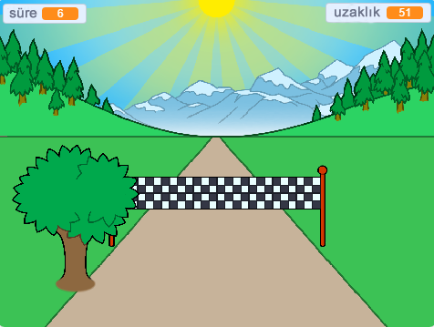

## Sırada ne var?

[Sprint](https://projects.raspberrypi.org/en/projects/sprint) Scratch projesine bir göz atın.

Bitiş çizgisine olabildiğince çabuk ulaşmak için sol ve sağ ok tuşlarını kullanmanız gereken kendi kukla oyununuzu yapmayı öğreneceksiniz.

--- no-print ---

  <iframe allowtransparency="true" width="485" height="402" src="https://scratch.mit.edu/projects/embed/298930696/?autostart=false" frameborder="0" scrolling="no"></iframe>
  

--- /no-print ---

--- print-only ---

--- /print-only ---