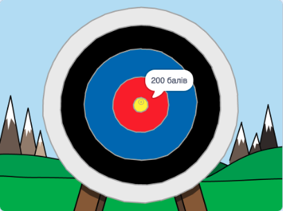

\--- no-print \---

Це — версія проєкту для **Скретч 3**. Також існує [версія проєкту для Скретч 2](https://projects.raspberrypi.org/en/projects/archery-scratch2).

\--- /no-print \---

## Вступ

Ти дізнаєшся як створити гру для стрільби з лука, в якій треба влучати стрілами якомога ближче до цілі.

### Що ти зробиш

\--- no-print \---

Натисни на зелений прапор для запуску. Використовуй клавішу пропуск, щоб стріляти

  <iframe allowtransparency="true" width="485" height="402" src="https://scratch.mit.edu/projects/embed/114760038/?autostart=false" frameborder="0" scrolling="no"></iframe>
  

\--- /no-print \---

\--- print-only \---

\--- /print-only \---

## \--- collapse \---

## title: Що тобі знадобиться

### Обладнання

+ Комп'ютер, що підтримує Скретч

### Програмне забезпечення

+ Скретч 3 (або [онлайн](http://rpf.io/scratchon){:target="_ blank"}, або [офлайн](http://rpf.io/scratchoff){:target="_ blank"})

### Завантаження

Початковий проєкт можна знайти [тут](http://rpf.io/p/en/archery-go){:target="_ blank"}.

\--- /collapse \---

## \--- collapse \---

## title: Чого ти навчишся

+ Використовувати анімацію 
+ Використовувати повідомлення
+ Використовувати випадкові числа

\--- /collapse \---

## \--- collapse \---

## title: Додаткова інформація для викладачів

\--- no-print \---

Якщо вам потрібно роздрукувати цей проєкт, будь ласка, скористайтеся [версією для друку](https://projects.raspberrypi.org/en/projects/archery/print){:target="_blank"}.

\--- /no-print \---

Ви можете знайти [завершений проєкт тут](http://rpf.io/p/en/archery-get){:target="_ blank"}.

\--- /collapse \---