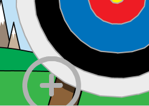

## Прицілювання

Почнемо зі створення стріли, яка рухається по екрану.

\--- task \---

Відкрий початковий проєкт у Скретч.

**Онлайн**: відкрий початковий проєкт на [rpf.io/archeryon](http://rpf.io/archeryon){:target="_ blank"}.

Якщо у тебе є обліковий запис Скретч, то ти можеш зробити копію проєкту, натиснувши **Ремікс**.

**Офлайн**: відкрий [початковий проєкт](http://rpf.io/p/en/archery-go){:target="_blank"} в офлайн-редакторі.

Якщо тобі треба завантажити та встановити офлайн-редактор Скретч, то ти можеш його знайти на [rpf.io/scratchoff](http://rpf.io/scratchoff){:target="_blank"}.

У початковому проєкті ти маєш бачити тло із мішенню та спрайт для приціла.


\--- /task \---

\--- task \---

Коли твоя гра починається, оповісти повідомленням, що нова стріла випущена.


```blocks3
when green flag clicked
broadcast (new arrow v)
```

\--- /task \---

\--- task \---

Після отримання цього повідомлення задай положення та розмір стріли.


```blocks3
when I receive [new arrow v]
go to x: (-150) y: (-150)
set size to (400) %
```

\--- /task \---

\--- task \---

Натисни на зелений прапор, щоб перевірити свою гру. Ти маєш побачити, як стріла збільшилася, і перемістилася в нижню ліву частину сцени.



\--- /task \---

\--- task \---

Додай код до стріли, щоб вона навмання `ковзала`{:class="block3motion"} по сцені `завжди`{:class="block3control"}.


```blocks3
when I receive [new arrow v]
go to x: (-150) y: (-150)
set size to (400) %
+forever
glide (0.5) secs to x: (pick random (-150) to (150)) y: (pick random (-150) to (150))
end
```

\--- /task \---

\--- task \---

Перевір свою гру ще раз, і ти маєш побачити, як стріла рухається випадковим чином по сцені.


\--- /task \---