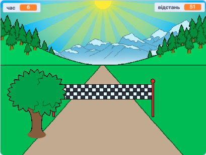

## Що далі?

Поглянь на проєкт Скретч [Спринт](https://projects.raspberrypi.org/uk-UA/projects/sprint).

Ти дізнаєшся як створити власну гру-спринт, в якій потрібно користуватися клавішами стрілки вліво та стрілки вправо, щоб якнайшвидше дістатися до фінішу.

--- no-print ---

  <iframe allowtransparency="true" width="485" height="402" src="https://scratch.mit.edu/projects/embed/298930696/?autostart=false" frameborder="0" scrolling="no"></iframe>
  

--- /no-print ---

--- print-only ---

--- /print-only ---

***
Переклад спільноти волонтерів

Цей проект переклали: Володимир Соботович і перевірили: Павло Фесенко.

Наші чудові добровольці з питань перекладу допомагають нам надати дітям у всьому світі можливість навчитися програмувати. Ви можете допомогти нам охопити більше дітей, перекладаючи наші проекти - подробиці на [rpf.io/translate](https://rpf.io/translate).