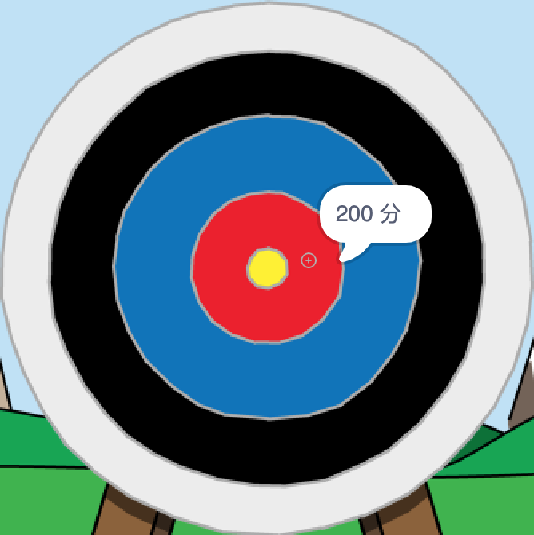

\--- no-print \---

这是该项目的 **Scratch 3** 版本。 项目还有一个 [Scratch 2版本](https://projects.raspberrypi.org/en/projects/archery-scratch2) 。

\--- /no-print \---

## 简介

您将学习如何创建一个正中靶心游戏，在该游戏中，您需要尽可能地让箭射中靶心。

### 学习成果

\--- no-print \---

点击 绿旗 开始。 使用空格键射箭

  <iframe allowtransparency="true" width="485" height="402" src="https://scratch.mit.edu/projects/embed/114760038/?autostart=false" frameborder="0" scrolling="no"></iframe>
  

\--- /no-print \---

\--- print-only \---

\--- /print-only \---

## \--- collapse \---

## 标题: 你需要准备什么

### 硬件部分

+ 一台能够运行 Scratch 的电脑

### 软件部分

+ Scratch 3 ([在线版本](http://rpf.io/scratchon){:target="_blank"} 或 [离线版本](http://rpf.io/scratchoff){:target="_blank"})

### 下载

初始项目在 [这里](http://rpf.io/p/en/archery-go){:target="_blank"}.

\--- /collapse \---

## \--- collapse \---

## 标题: 你将学到什么

+ 使用动画 
+ 使用消息广播
+ 使用随机数

\--- /collapse \---

## \--- collapse \---

## 标题: 为教育者提供的额外信息

\--- no-print \---

如果您需要打印此项目，请使用 [打印专用的版本](https://projects.raspberrypi.org/en/projects/archery/print){:target="_blank"}.

\--- /no-print \---

你可以在这里找到[完整的项目](http://rpf.io/p/en/archery-get){:target="_blank"}.

\--- /collapse \---