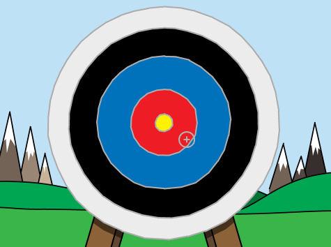
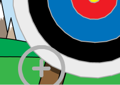

## 瞄箭

让我们从创建一个在屏幕上移动的箭开始。

\--- task \---

打开 Scratch 初始项目。

**Online**: open the starter project at [rpf.io/archeryon](https://rpf.io/archeryon){:target="_blank"}.

如果您有一个 Scratch 帐户，您可以通过点击 **改编** 复制该项目。

**Offline**: open the [starter project](https://rpf.io/p/en/archery-go){:target="_blank"} in the offline editor.

If you need to download and install the Scratch offline editor, you can find it at [rpf.io/scratchoff](https://rpf.io/scratchoff){:target="_blank"}.

在初始项目中，您应该看到一个靶子的背景和一个十字准心的角色。



\--- /task \---

\--- task \---

游戏开始时，广播一条消息用于发射新箭。


```blocks3
when green flag clicked
broadcast (new arrow v)
```

\--- /task \---

\--- task \---

接收到此消息后，设置准心的位置和大小。


```blocks3
when I receive [new arrow v]
go to x: (-150) y: (-150)
set size to (400) %
```

\--- /task \---

\--- task \---

单击绿色小旗标志来测试您的游戏。 您应该看到准心变大并移到舞台的左下角。



\--- /task \---

\--- task \---

将代码添加到您的准心角色，使其`滑行`并`重复执行`{:class ="block3control"} 到随机位置。


```blocks3
when I receive [new arrow v]
go to x: (-150) y: (-150)
set size to (400) %
+forever
glide (0.5) secs to x: (pick random (-150) to (150)) y: (pick random (-150) to (150))
end
```

\--- /task \---

\--- task \---

再次测试您的游戏，您应该能看到准心在舞台上随机移动。


\--- /task \---