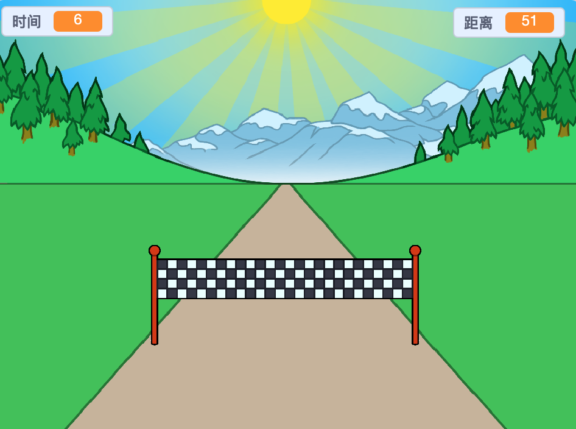

## 接下来还有什么？

看一下 [冲刺](https://projects.raspberrypi.org/en/projects/sprint) Scratch 项目。

您将学习如何创建自己的 冲刺游戏，在该游戏中，您必须使用左方向键和右方向键尽快到达终点。

--- no-print ---

  <iframe allowtransparency="true" width="485" height="402" src="https://scratch.mit.edu/projects/embed/298930696/?autostart=false" frameborder="0" scrolling="no"></iframe>
  

--- /no-print ---

--- print-only ---

--- /print-only ---

***

该项目由以下志愿者翻译：

王正坤
鄢然

正因为志愿者们的辛勤工作，我们才能为世界各地的人们提供用母语来学习的机会。您也可以通过志愿翻译工作来帮助我们吸引更多的人 - 更多信息，请访问[rpf.io/translate](https://rpf.io/translate)。
